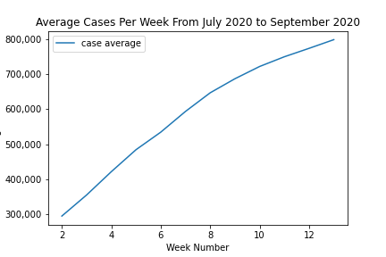
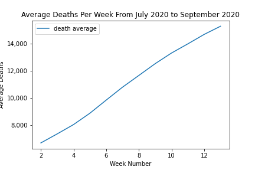
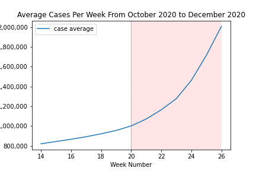
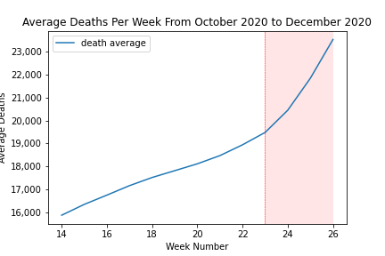
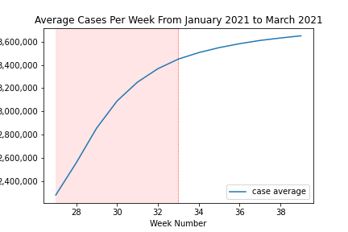
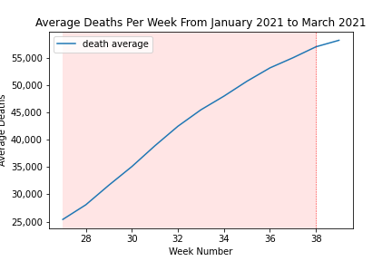
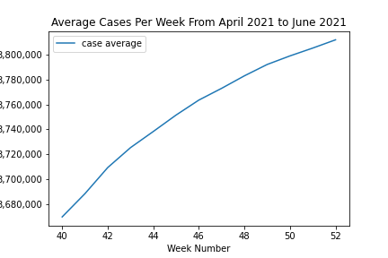

# Analysis  of COVID in California

## Questions to answer

* What was the total case rate and death rate for the state of California?
* When did COVID peak in California within the timeframe?
* Which counties were most  affected by COVID?
* Which counties were least affected by COVID?
* Is there correlation between number of covid cases and population/area of the county?

## The Data Used

The data set has  cumulative data for each county in the United States.

Reference data set: https://www.kaggle.com/datasets/fireballbyedimyrnmom/us-counties-covid-19-dataset 

Shortened the dataset to focus on  California’s 58 counties from July 1st, 2020 through June 30, 2021.

# State Analysis

Date Range: July 1st, 2020 through June 30, 2021
Total Number of Cases in State of California  : 3580246
Total Number of Deaths in State of California  : 58030
Ratio of Total Number Deaths to Total Number of Cases is shown through a pie chart.

# County Death Rate

Calculated Death Rate = Total Number of Deaths/Total Number of cases

County with Max Death Rate : Imperial County with 2.8%,
County with Min Death Rate: Alpine and Sierra County with 0.0% 

Top 5 County Death Rate :

Imperial County : 2.87%
Alameda County : 1.85%
Orange County : 1.844%
Shasta County: 1.842%
Los Angeles County : 1.841%

## Most Affected Counties

Top 5 counties that are mostly affected in our timeframe are Los Angeles, San Bernardino, Riverside, San Diego and Orange. All of these counties are in Southern California.

## Least Affected Counties

Bottom 5 counties that are least affected in our timeframe are Sierra, Alpine, Trinity, Mariposa and Modoc.

## Correlation Analyses (County Covid Cases/Deaths versus County Population/Area(Sqr mil))

The correlation between covid cases and population is 0.98 while correlation between covid cases and area (sqr mil) is 0.25.

The correlation between covid deaths and population is 0.97 while correlation between covid deaths and area (sqr mil) is 0.22.

## Covid Timeline Analysis
Despite a lockdown renewed on December 3rd in California, the cases grew dramatically during the holiday season. This makes sense assuming people are shopping, traveling and coming in contact with more people during this time.

During the surge, the biggest dip in daily cases was on December 25th, 2020. We conclude that people did not check, themselves in  because of Christmas. This leads to the highest number of cases recorded the following day on December 26th, 2020. The day after Christmas day recorded 64,986 new covid cases.

The growth of Covid cases and low vaccine distributions results to an increase in deaths in the early months of 2021. The spike in deaths reaching 1,084 deaths on February 24th, 2022.

In early 2021 vaccines become more available and accoring to CBS news 20 million Californians are partially or fully vaccinated as of May 28th 2021. With more people getting vaccinated the timeline of Covid Cases shows cumilitive cases flattening in between February and March. 

## Weekly COVID cases and death analysis
Our data set began on July 1 2020 of note on June 15, 2020 51/58 counties in California had reopened with optional face coverings. 
We see that beginning in July there was an increase in the number of new cases and deaths that continued into August. 

On July 13 30 counties were again shut down due to the July increases, resulting in a decrease in new cases and deaths in August. This decrease in cases continued until September 16 when the lowest number of new cases was recorded. As a result of the decrease businesses were again allowed to reopen beginning in October. 

In November we begin to see a sharp increase in number of new cases and deaths which continues through the end of 2020 nad into 2021. On November 16 all non-essential businesses in Los Angeles county are closed and the mask mandate is reinstated.

On December 23 there Los Angeles county is at 0% capacity for ICU beds and there is a shortage of PPE, by December 26 the ICU bed shortage is statewide. This shortage paired with an O2 shortage negatively impacts survivability for those patients requiring ICU level care. 

## Weekly Analysis
During the July 2020 to September 2020 quarter there is a steady increase in average cases and average deaths.

From October 2020 to December 2020 cases rise over time with a steep increase starting the week of November 7th up to February 6th. The number of deaths have a steep increase between November 28th and March 13th.

From January 2021 to March 2021 cases and deaths the cases rise steadily and plateau the week of February 6th, the deaths rise steadily the entire trimester.

From April 2021 to June 2021 deaths and cases rise steadily, deaths dip slightly and don't increase between the weeks of May 29th and June 5th but deaths rise again after this period.

